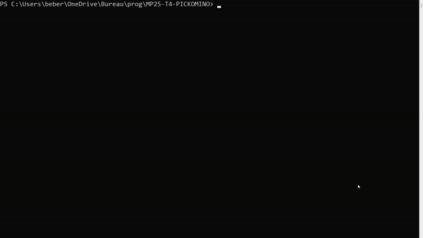

# Mini-projet : Pickomino

- [Mini-projet : Pickomino](#mini-projet--pickomino)
  - [Présentation](#présentation)
  - [Utilisation](#utilisation)
  - [Changelog](#changelog)
  - [TODO](#todo)
  - [Défauts constatés non corrigés](#défauts-constatés-non-corrigés)
  - [Équipe de développement](#équipe-de-développement)

---

## Présentation

## Utilisation

```bash
$ make

$ ./pickomino.out
```



## Changelog

## TODO

## Défauts constatés non corrigés

## Équipe de développement

---
&copy; 2024-2025 LaSalle Avignon
